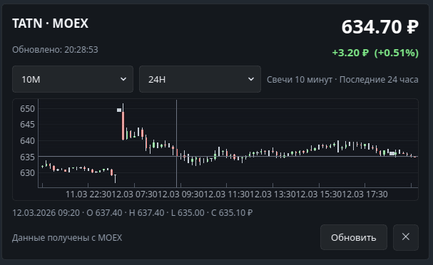

# MOEX Widget



Компактный desktop‑виджет для Linux/KDE с графиком акций Московской биржи.

Приложение написано на Python + PyQt6 и предназначено для быстрого локального мониторинга бумаг MOEX без браузерного терминала. Виджет показывает актуальную цену, изменение на выбранном диапазоне и интерактивный свечной график.

---

## Возможности

- отображение актуальной цены бумаги
- свечной график
- выбор таймфрейма
- выбор глубины истории
- zoom колесом мыши
- drag графика
- hover по свечам
- компактный интерфейс для Linux/KDE

---

## Структура проекта

```
MOEX/
├── charts/         # графики
├── data/           # клиент MOEX и интервалы
├── services/       # аналитика
├── ui/             # интерфейс и стили
├── config.py       # настройки
├── main.py         # точка входа
└── install.sh      # автоматическая установка
```
---

## Требования

Минимальные требования:

- Linux
- Python 3.10+
- git
- доступ в интернет

Рекомендуется:

- KDE Plasma
- python3-venv

---

## Быстрая установка

Одной командой:

bash <(curl -fsSL https://raw.githubusercontent.com/wa3x/MOEX/master/install.sh)

Скрипт автоматически:

1. клонирует репозиторий
2. создаёт виртуальное окружение
3. устанавливает зависимости
4. создаёт команду запуска

---

## Ручная установка

```
git clone https://github.com/wa3x/MOEX.git
cd MOEX
python3 -m venv .venv
source .venv/bin/activate
pip install -r requirements.txt
python main.py
```

---

## Запуск

Если использовался install.sh:

moex-widget

или

~/.local/bin/moex-widget

---

## Управление графиком

Колесо мыши — zoom  
Shift + колесо — масштаб цены  
Drag — перемещение графика  
Двойной клик — сброс масштаба  
Наведение — данные свечи

---

## Настройки

Основные параметры в config.py:

DEFAULT_TICKER  
WINDOW_WIDTH  
WINDOW_HEIGHT  
UPDATE_INTERVAL_MS

---

## Зависимости

PyQt6  
pyqtgraph  
requests

---

## Возможные улучшения

- выбор тикера из интерфейса
- несколько графиков
- список избранных бумаг
- автозапуск KDE
- уведомления о движении цены

---

## Лицензия

Этот проект распространяется под лицензией MIT.

Copyright (c) 2026 [wa3x](https://github.com/wa3x/MOEX)